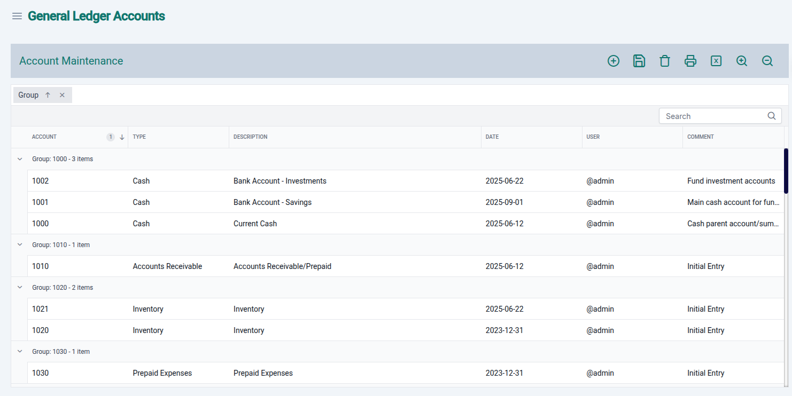
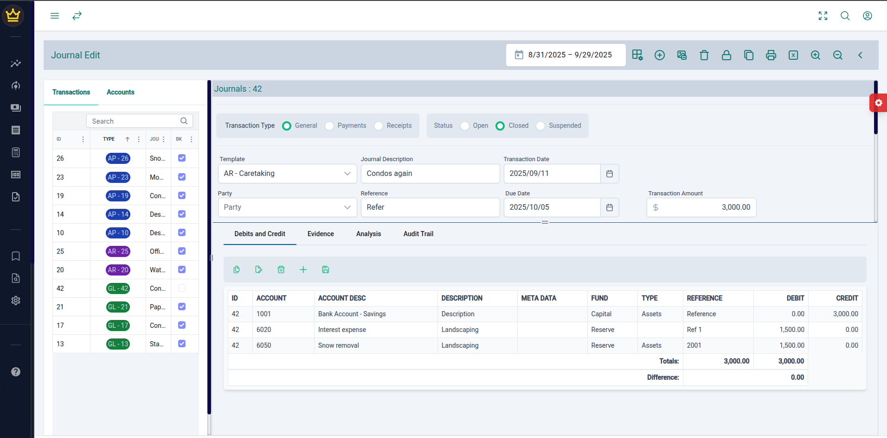
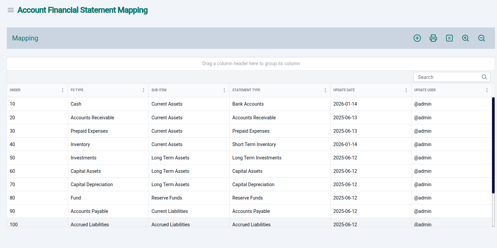
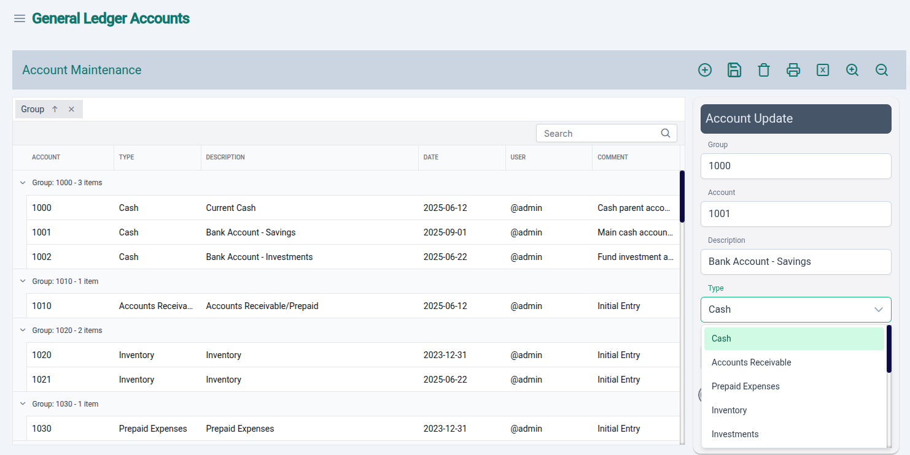

## Setting up the initial reference data

In order to create your first general ledger entry we must first ensure we have created and verified our "Chart of Account" (COA). The initial state of the COA has been included in the initial installation of the application. This COA is suitable to a Condominium Non-Profit organizations however it is meant as a reference as it most likely not match your currently used COA of your organization. For the purposes of this discussion I will use the current COA, delivered with application.

### Viewing Chart of Accounts

- Select the 'Reference Management' menu item from main menu on the left side of the screen. Then select 'General Ledger Accounts' from the panel.

- You should see a screen that is similar to image above.

### Account Statement Mapping

Financial statements, particularly the income and balance sheet statements are summarized or segregated by the data entries provided in the mapping table. This divides the accounts into the necessary categories for financial reporting. The basics are assets and liabilities. The statements are further broken down by the hierarchy that is created in the COA. The formation of this hierarchy is editable by the user to mean the necessary reporting requirements of each organization. In the COA screen, if we were to group the list by 'type' and 'group' the structure becomes move visible.

### Using General Ledger Accounts

The chart of account are mapped to the financial statements using the financial statement mapping table.

Allocation of accounts in the financial statements values. Select the chart of accounts values and assign a financial statement value. 

