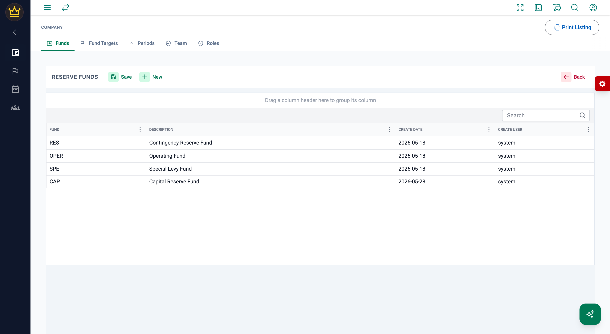
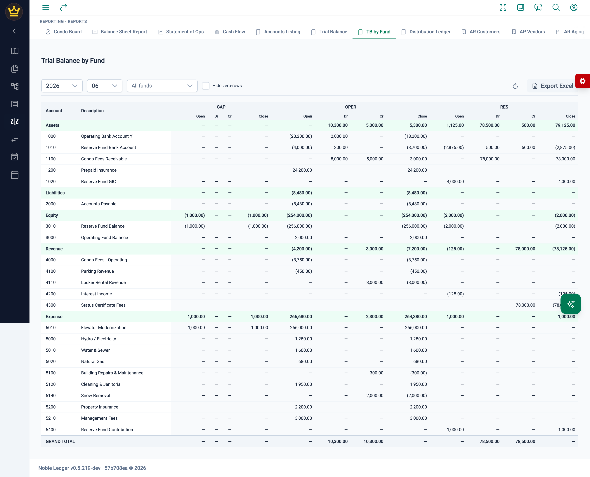
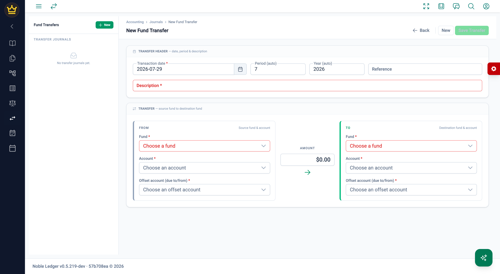
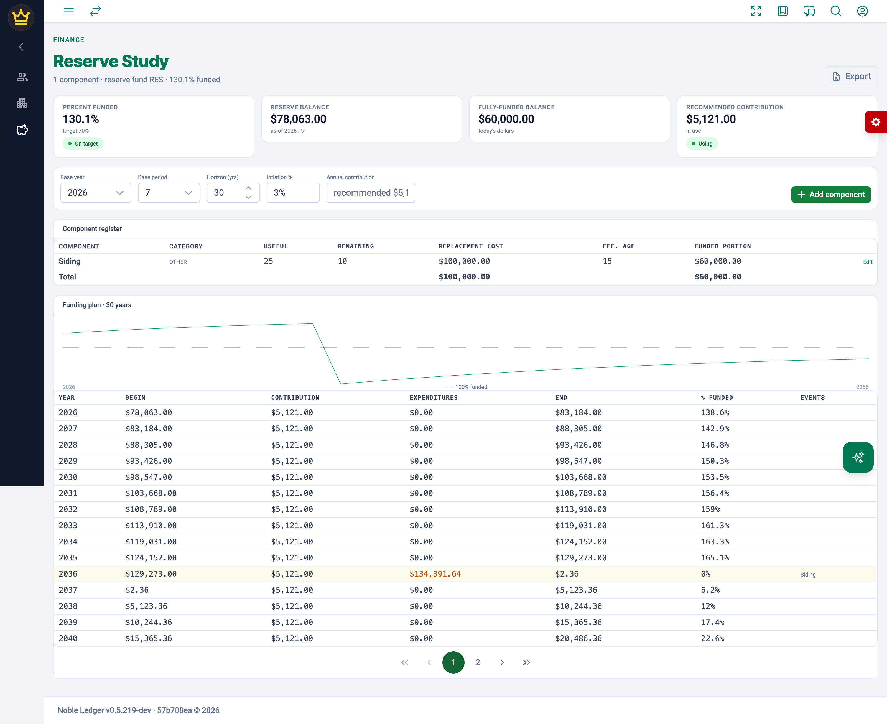
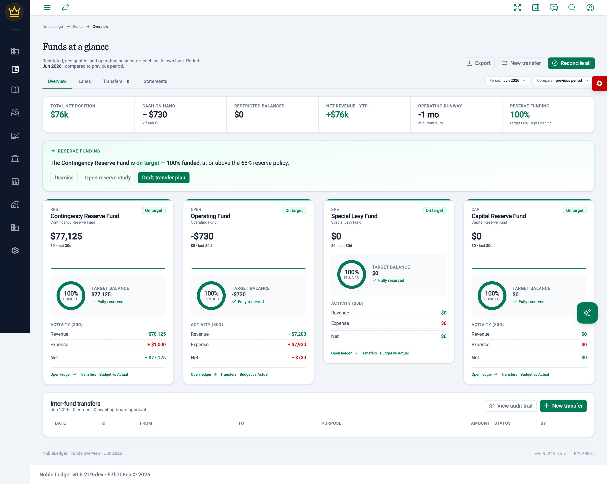
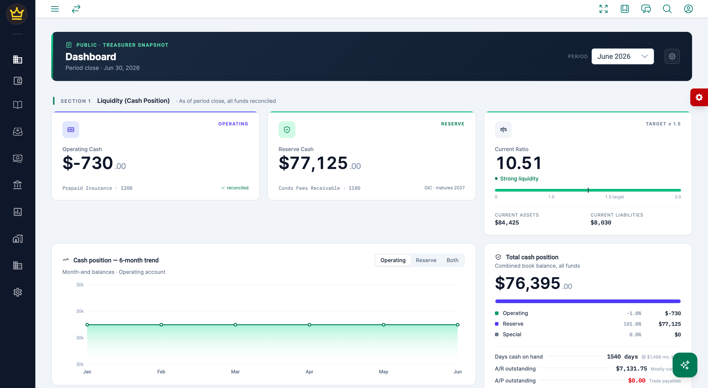

Most accounting packages treat a condominium corporation as if it were a small
business with one pot of money. It isn't. A condo corporation is a steward of
several legally distinct pots — an operating fund, a reserve fund, sometimes a
special levy fund — and the rules governing them differ. Money contributed to
the reserve fund is not available to cover a shortfall in landscaping, and a
board that lets the two blur together is heading for a qualified audit opinion
or a special assessment nobody saw coming.

Noble Ledger treats the fund as a first-class dimension of the ledger rather
than a reporting afterthought. This document explains how that works in the
product, what the system guarantees, and how a board actually uses it month to
month.

If you want the concept rather than the implementation, start with
[What is Fund Accounting?](/accounting/fund_accounting/) and
[What is a Reserve Fund?](/accounting/reserve_fund/). This page assumes you
already accept the idea and want to know what the software does.

---

## 1. How a fund is modelled

A fund in Noble Ledger is a catalogue record, maintained under
**Company → Funds** (`/company/funds`). Each fund carries:

| Field | Meaning | Editable in the UI? |
|---|---|---|
| `fund` | Short code used on every journal line — e.g. `OPER`, `RES` | Yes (fixed after creation) |
| `description` | Display name — e.g. "Contingency Reserve Fund" | Yes |
| `disallow_negative` | When set, the system refuses to post a journal that would drive this fund's projected balance below zero | Yes |
| `restriction` | `unrestricted`, `temporarily_restricted`, or `permanently_restricted` | **Not yet** — data/API only; see [scope notes](#11-honest-notes-on-scope) |

A representative fund catalogue for a condo corporation looks like this:

| Code | Description |
|---|---|
| `OPER` | Operating Fund |
| `RES` | Contingency Reserve Fund |
| `CAP` | Capital Reserve Fund |
| `SPE` | Special Levy Fund |



### Funds are a dimension, not a copy of the chart of accounts

This is the single most important design decision in the system, and the one
most often gotten wrong elsewhere.

**The chart of accounts is not fund-scoped.** There is no "operating cash" account
and a separate "reserve cash" account duplicated per fund. There is one account
`1010 — Reserve Fund Bank Account`, and every journal *line* carries its own
`fund` code. The fund is a dimension on the transaction, the way a department or
class would be — except that, unlike a class in QuickBooks, it is enforced.

The practical consequence: adding a fifth fund does not mean cloning eighty
accounts. Your chart of accounts stays the size of your business, and the fund
dimension does the separating.

---

## 2. The core guarantee: every fund self-balances

This is what separates real fund accounting from tagging transactions with a
label.

When a journal is submitted, the server checks two things, not one:

1. Total debits equal total credits across the whole journal.
2. **Debits equal credits within every individual fund touched by the journal.**

The second check is the one that matters. It is enforced server-side in
`assertBalancedDetails`, so it holds regardless of which screen, import, or
integration produced the entry:

```go
// Every line writes to both maps under the same fund key, so the key
// sets are identical — iterating one map covers all funds.
for fund, dr := range drByFund {
    if math.Abs(dr-crByFund[fund]) > journalBalanceTolerance {
        return fmt.Errorf(
            "fund %q unbalanced: debits %.2f != credits %.2f",
            fund, dr, crByFund[fund],
        )
    }
}
```

A journal that debits operating cash and credits reserve equity is *rejected*,
even though it balances overall. There is no path — no screen, no bulk import,
no API call — that can quietly leave the reserve fund carrying half a
transaction.

### What that buys you

Because every fund self-balances by construction, **each fund has a complete,
standalone set of books**. You can produce a balance sheet for the reserve fund
alone and it will balance. You can hand an auditor the reserve fund's trial
balance and it will foot. This is not a report that reassembles the numbers
after the fact — it is a structural property of the data.

Here is the January 2026 trial balance for the reserve fund of a live tenant,
pulled straight from the ledger:

| Type | Account | Description | Debit | Credit |
|---|---|---|---:|---:|
| ASSET | 1010 | Reserve Fund Bank Account | 1,125.00 | 4,000.00 |
| ASSET | 1020 | Reserve Fund GIC | 4,000.00 | — |
| EQUITY | 3010 | Reserve Fund Balance | — | 2,000.00 |
| REVENUE | 4200 | Interest Income | — | 125.00 |
| EXPENSE | 5400 | Reserve Fund Contribution | 1,000.00 | — |
| | | **Total** | **6,125.00** | **6,125.00** |

And the operating fund for the same period, from the same ledger, balances
independently at **50,580.00 debits against 50,580.00 credits** across its
fourteen active accounts. Neither total was computed by a report; both are
simply what the fund contains.

The **Trial Balance by Fund** report shows this directly — one column group per
fund, each with its own opening, debit, credit, and closing columns, and a
grand total row where every fund foots on its own:



Read the bottom row: the operating fund totals 10,300.00 debits against
10,300.00 credits, and the reserve fund 78,500.00 against 78,500.00. Neither
borrows from the other to balance.

---

## 3. Moving money between funds

Boards move money between funds constantly — the monthly reserve contribution,
a draw from reserve to pay a roofing contractor, reimbursing operating for
administrative costs of a special levy. Because of the self-balancing rule, a
transfer cannot be two lines. It must be four.

**GL → Fund Transfer** (`/journals/fund-transfer`) exists so nobody has to
hand-build that entry. You supply:

- source fund and its cash account
- destination fund and its cash account
- an inter-fund offset account (due-to / due-from) on each side
- date, amount, description, reference

and the page posts a four-line journal: cash and offset in the source fund,
cash and offset in the destination fund. Each fund's two lines balance, so the
journal passes the server check, and the due-to/due-from pair leaves a visible
inter-fund receivable and payable rather than an unexplained equity movement.

The two offset lines are stamped with an `INTERFUND` marker in metadata. That
matters on read-back: a four-line journal with one debit and one credit in each
fund is perfectly symmetric, so without the marker the system could not tell
which fund was the source and which the destination. With it, the direction
round-trips, and the Funds Overview can render the transfer as "Operating →
Reserve" rather than an ambiguous pair.

The period and fiscal year are derived automatically from the transaction date,
so picking 2026-01-03 sets period 1 of 2026 without the user maintaining two
fields by hand.



---

## 4. Charging owners: assessments

Fund accounting for a condo corporation only works if the money arrives in the
right fund in the first place. Noble Ledger handles this at the point of
billing.

### Units and owners

**Community → Units** (`/community/condo-units`) holds the unit register: unit
number, type, floor, square footage, `monthly_fee`, and `unit_fraction` — the
ownership fraction, captured to six decimal places. That fraction is the legal
basis for allocating shared costs, and the system uses it directly rather than
approximating from square footage.

**Community → Owners** (`/community/condo-owners`) holds owners, each linked to
a unit and mapped to a specific receivable account (`ar_account` / `ar_child`),
with ownership start and end dates and an active status.

### The monthly assessment run

**AR → Assessments** (`/ar/assessments`) generates the month's dues for every
owner in one pass. You choose:

- **Basis** — *Flat fee*, using each unit's `monthly_fee`; or *Proportional*,
  allocating a budget total across units by `unit_fraction`.
- **Reserve split** — the percentage of each owner's dues that belongs to the
  reserve fund rather than operating.

That last setting is where fund accounting meets the owner. Each owner's charge
is split at billing time into an operating component and a reserve component,
and the resulting journal credits revenue in each fund separately. The reserve
fund's share of this month's dues lands in the reserve fund on the day it is
billed — not swept across later, and not reconstructed at year end.

The run is **preview-first**. The page calls the server with `dry_run: true`
and shows the complete result before anything posts: one line per owner with
unit, receivable account, gross, operating amount, and reserve amount; totals;
and an explicit list of owners who were *skipped* with a reason
(`INACTIVE`, `MISSING_AR_MAPPING`, `NO_FEE`). Only after you confirm does it
commit. The preview is invalidated automatically if you change any parameter,
so you cannot approve one set of numbers and post another. The whole preview
exports to Excel for the board package.

Double-billing is blocked outright: if a monthly run already exists for the
selected period, the page says so and **disables Generate**. You cannot bill
the same month twice by accident.


The screenshot above is a live preview at a 25% reserve split. Every owner's
gross charge is split into an operating and a reserve component, and the totals
foot: **3,752.00 gross = 2,814.00 operating + 938.00 reserve**. The footer
names the funds the two halves will land in (`OPER` and `RES`), and the amber
banner is the duplicate-run block doing its job.

### Special assessments

A capital levy is not recurring dues, and Noble Ledger models it separately —
as a **Special assessments** tab alongside Recurring assessments on the
Assessments screen, with its own campaign pages under
`/ar/special-assessments`. A special assessment has:

- a total amount and a target fund (operating or reserve)
- an allocation method — by ownership **fraction** or **equally** per unit
- a number of **installments** and a first due date
- a levy date, which is the date of the accrual journal

On commit, the system posts one accrual journal for the whole levy and creates
a campaign that is then tracked to completion. The rounding remainder is
reconciled so that the sum of the owner shares equals the levy total exactly —
the campaign cannot drift from the amount the board approved.

Each campaign then reports **levied, collected, and outstanding**, both in total
and per owner with their installment schedule. A board can answer "how much of
the elevator levy is still out there, and from whom" without a spreadsheet.

Owner statements show the unit's ownership share alongside the charges, so an
owner receiving a bill can see the basis on which it was calculated.

---

## 5. Managing the reserve fund

The reserve fund is where a condo board carries the most risk, and Noble Ledger
supports it with a real reserve study engine rather than a balance and a hope.

### The component register

**Community → Reserve Study** (`/reserve-study`) maintains the capital
components: name, category (roofing, mechanical, exterior, paving, other),
useful life in years, remaining life in years, current replacement cost, and
notes.

### The projection

From that register the server computes a funding projection over a chosen
horizon, given an inflation rate and either a proposed annual contribution or
the system's recommended one. For each year it returns:

- beginning balance, contribution, expenditures, ending balance
- the **fully funded balance** — what the reserve *should* hold given the
  accumulated wear on every component
- **percent funded** — the standard health measure for a reserve fund
- the replacement **events** falling in that year

The calculation is server-authoritative, so the number in the board minutes,
the number on the dashboard, and the number in the export are the same number.

This is what lets a board have the conversation that actually matters: not
"the reserve has $1.8m", but "the reserve is 61% funded, the roof lands in
year 7, and at the current contribution we dip below zero in year 9."



Each component contributes its own funded portion — in the example above, a
siding component with a 25-year useful life and 10 years remaining is 15 years
into its life, so $60,000 of its $100,000 replacement cost should already be
sitting in the reserve. Sum that across every component and you have the
fully-funded balance.

### Fund targets

**Company → Fund Targets** (`/company/fund-targets`) records a board-approved
target balance for any fund, with an as-of date and a free-text note — for
example, *"Per board minute 2026-02-12; reserve study v3.2."* The target drives
the funded-percentage and gap figures shown throughout the dashboards, and the
note keeps the provenance of the number attached to the number.

A separate board setting holds the reserve **policy target percentage**. Where
no target is configured the system falls back to a default rather than showing
a blank.

---

## 6. Seeing the funds

### Funds Overview

**Dashboards → Funds Overview** (`/finance`) is the fund-accounting cockpit. It
is fully live — it composes from the per-fund trial balance, the account-amount
history, the fund catalogue, the board-approved targets, and the journals.

For each fund it shows a lane with balance, target, funded percentage, current
period movement, a sparkline of the running balance, and a "gap to plan"
figure. Lanes are classified automatically: a fund at or above target is
highlighted, and a fund whose current-period activity exceeds 3% of its closing
balance in the negative direction is flagged as a warning — so a fund draining
faster than usual surfaces itself.

Above the lanes sits a rollup: total net position, cash on hand, **restricted
balances**, net revenue year-to-date, operating runway in months at the current
burn rate, and reserve funding percentage against the policy target with the
shortfall in points.

Restricted balances are summed from each fund's actual `restriction` class, not
inferred from its name. A corporation with two restricted funds gets both; one
that has restricted something other than the reserve gets the right answer
anyway.



Note the **Restricted balances** tile reading `$0 · —` in the screenshot: the
reference tenant has not classified any fund as restricted yet, and the tile
reports that honestly rather than guessing from the word "Reserve" in a fund's
name. See the [scope notes](#11-honest-notes-on-scope).

Below the lanes, the transfer register reconstructs inter-fund movements from
the journals themselves. A journal touching several funds is decomposed into
reciprocal source → destination legs that sum back to each fund's net movement,
rather than collapsing to a single pair and silently dropping the rest. Each
leg shows date, direction, amount, description, who posted it, and whether it
is posted or pending.

### Condo Board dashboard

**Dashboards → Condo Board** (`/dashboards`) is the board-meeting view:
operating, reserve, and special fund balances with prior-period comparison,
current assets and liabilities, days cash on hand, monthly burn, AR and AP
totals, receipts and payments due in the next 30 days, operating and reserve
trend lines, and the last close date.

The operating and reserve cash figures come from a single shared derivation
used by both the dashboard and its printable report, so the screen and the
board package cannot disagree. Cash is split by each trial-balance row's own
fund, matched against the fund catalogue — never by an attribute on the
account, precisely because accounts are not fund-scoped.

Metrics that are still loading render as placeholders rather than a misleading
`$0.00`.



The whole dashboard has a print/PDF counterpart for board packages.

### Trial Balance by Fund

**Reports → Trial Balance by Fund** (`/reporting/trial-balance-by-fund`) is the
workhorse. Per fund and period it returns each account's opening balance,
year-to-date activity, budget, and closing balance. It is the report an auditor
asks for, and it is the same data the dashboards are built from.

---

## 7. Controls: period close and year-end

Fund separation is only as good as the discipline around closing.

### Period close

**GL → Period Close** (`/journals/period-close`) runs a checklist before a
period can be closed. Each check has a severity:

| Check | Severity | What it verifies |
|---|---|---|
| Trial balance is balanced | Blocker | Debits equal credits across all funds for the period, within half a cent |
| All bank accounts reconciled | Error | Every linked bank account has zero variance and no outstanding cash movements at period end |
| No unmapped accounts received postings | Error | Every account posted to this period is assigned to a reporting hierarchy node, so nothing falls into an "uncategorised" bucket |
| No open or draft journals in period | Warning | Journal headers in the closing period that were never booked |
| AR aging snapshot | Advisory | Receivables position at close |

Failures link straight to the screen where the problem can be fixed.

### Year-end

**GL → Year-End** (`/journals/year-end`) closes revenue and expense to equity —
**per fund**. The plan shows one row for each fund touched, with its revenue
total, expense total, and signed surplus, and lets you nominate the
retained-earnings account that fund's surplus closes into.

This is the fund-balance rollforward, and it is the step that most general
ledger packages force a condo bookkeeper to do by hand with journal entries.
Each fund's surplus or deficit rolls into that fund's own balance, so the
reserve fund's accumulated balance is the sum of its own history and nothing
else.

---

## 8. Guardrails

Beyond the self-balancing rule, three mechanisms protect fund integrity:

**Restriction classes.** Each fund is classified `unrestricted`,
`temporarily_restricted`, or `permanently_restricted`. The classification
drives restricted-net-asset reporting rather than being decorative.

**Per-fund negative balance block.** A fund flagged `disallow_negative` will
refuse a journal that would push its projected balance below zero. On funds
without the flag the same condition is a soft warning. A board can therefore
hard-block overdrawing the reserve while leaving operating free to run a
temporary deficit.

**Audit trail.** Every journal records who created it, who booked it, and when.
The Audit Trail screen (`/audit-trail`) exposes that history, and evidence
(invoices, contracts, board minutes) attaches to journal entries so the support
for a reserve draw sits with the entry itself.

---

## 9. What a month looks like

Putting it together, the recurring cycle for a condo corporation:

1. **Bill the owners.** Run the monthly assessment with the board's reserve
   split. Preview, check the skipped list, commit. Operating and reserve each
   receive their share at billing.
2. **Take in receipts.** Owner payments clear the receivables raised by the run;
   delinquencies surface on the AR aging and delinquency screens.
3. **Pay the bills.** Vendor bills post against the fund that bears the cost —
   a roofing invoice to reserve, hydro to operating.
4. **Move money deliberately.** Use Fund Transfer for the monthly reserve
   contribution or a project draw, so the movement is a visible due-to/due-from
   rather than a silent reallocation.
5. **Reconcile the bank.** Bank feed and reconciliation clear cash.
6. **Look at the funds.** Funds Overview for the funded percentages, gaps, and
   runway; Condo Board dashboard for the meeting.
7. **Close the period.** Work the checklist until the blockers clear.
8. **Once a year**, refresh the reserve study, reset targets, and run year-end
   so each fund's surplus rolls into its own balance.

---

## 10. What this gives the board

- **A defensible answer to "is the reserve fund adequate?"** — percent funded
  against a study, not a bank balance against intuition.
- **Fund separation that cannot be violated by accident** — enforced at the
  server, on every path into the ledger.
- **Standalone books per fund** — a reserve fund balance sheet that actually
  balances, ready for the auditor.
- **Owner charges that land in the right fund on day one** — the reserve split
  happens at billing, not in a year-end reallocation.
- **Special levies tracked to the last dollar** — levied, collected,
  outstanding, per owner, per installment.
- **A close that is a checklist rather than an act of faith.**
- **Continuity across boards** — targets carry the minute that approved them,
  journals carry their evidence, and the audit trail carries the rest.

---

## 11. Honest notes on scope

Documentation is worth less than nothing if it oversells, so:

- **Restriction classes have no UI editor yet.** The `restriction` column
  exists on every fund, is carried through the API, and drives the "Restricted
  balances" rollup — but the Funds maintenance dialog exposes only the fund
  code, description, and `disallow_negative`. Setting a fund to
  `temporarily_restricted` currently requires going through the API or the
  database. A fund defaults to `unrestricted`, so in the reference tenant all
  four funds are unrestricted and the Restricted balances tile reads **$0**.
  Treat restricted-net-asset reporting as plumbed end to end but not yet
  self-service.
- **The reserve study needs its reserve fund mapped in board settings.** The
  projection resolves the reserve fund from configuration, not by name. Where
  that mapping is absent the page still lists components and computes each
  one's funded portion, but reserve balance and percent funded read zero — as
  they do in the reference tenant. Map the reserve fund before quoting a
  percent-funded figure to a board.
- **The reserve split percentage is a parameter of the assessment run**, chosen
  per run. It is not yet a standing board policy that the run inherits
  automatically.
- **Fund targets are a single current target per fund**, with an as-of date —
  not a year-by-year schedule.
- **`disallow_negative` is a pre-flight projected-balance check**, not a
  database constraint.

---

## 12. Where things live

| Task | Screen | Route |
|---|---|---|
| Maintain funds | Company → Funds | `/company/funds` |
| Set board-approved fund targets | Company → Fund Targets | `/company/fund-targets` |
| Unit register and ownership fractions | Community → Units | `/community/condo-units` |
| Owner register and AR mapping | Community → Owners | `/community/condo-owners` |
| Reserve components and projection | Community → Reserve Study | `/reserve-study` |
| Fund cockpit — lanes, rollup, transfers | Dashboards → Funds Overview | `/finance` |
| Board meeting dashboard | Dashboards → Condo Board | `/dashboards` |
| Move money between funds | GL → Fund Transfer | `/journals/fund-transfer` |
| Per-fund trial balance | Reports → Trial Balance by Fund | `/reporting/trial-balance-by-fund` |
| Monthly dues assessment run | AR → Assessments | `/ar/assessments` |
| Special assessments (capital levies) | AR → Special Assessments | `/ar/special-assessments` |
| Arrears | AR → Delinquencies | `/ar/delinquencies` |
| Close a period | GL → Period Close | `/journals/period-close` |
| Roll fund surpluses to equity | GL → Year-End | `/journals/year-end` |
| Reconcile cash | Banking → Bank Reconciliation | `/journals/bank-reconciliation` |
| Who did what | System → Audit Trail | `/audit-trail` |

All routes are tenant-scoped — the live URL carries the corporation's tenant
segment ahead of the path.

---

*Disclaimer: For general informational purposes only. Not legal, financial,
accounting, or tax advice.*
